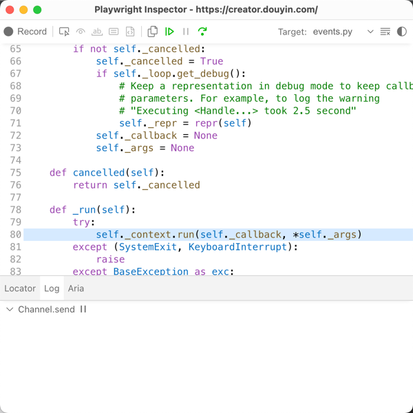

# 多平台视频自动上传服务

[](https://python.org)
[](https://fastapi.tiangolo.com)
[](LICENSE)

基于Web自动化技术的多平台视频上传服务，使用Playwright实现浏览器自动化操作，支持单个和批量视频上传。



## ✨ 特性

- 🔐 **多账号支持** - 支持多个平台账号的登录和管理
- 📤 **智能上传** - 自动填充标题、标签和缩略图
- ⏰ **定时发布** - 支持指定时间的定时发布功能
- 🚀 **批量操作** - 支持多视频批量上传和智能时间调度
- 🌍 **地理位置** - 支持设置发布地理位置
- 🛡️ **防检测** - 内置反自动化检测机制
- 📊 **API服务** - 提供完整的RESTful API接口
- 🎯 **强类型** - 使用Pydantic进行数据验证和类型检查

## 🏗️ 架构

```
video_uploader/
├── src/video_uploader/           # 主源码目录
│   ├── api/                      # FastAPI路由和应用
│   ├── core/                     # 核心业务逻辑
│   ├── models/                   # 数据模型定义（强类型）
│   ├── services/                 # 业务服务层
│   └── utils/                    # 工具模块
├── tests/                        # 测试用例
│   ├── unit/                     # 单元测试
│   └── integration/              # 集成测试
├── examples/                     # 示例配置文件
├── data/                         # 数据存储目录
├── main.py                       # 简洁的主入口文件
└── pyproject.toml               # 项目配置（uv管理）
```

## 🚀 快速开始

### 环境要求

- Python 3.10+
- Chrome/Chromium 浏览器
- uv 包管理器

### 安装依赖

```bash
# 使用uv安装依赖
uv sync

# 安装Playwright浏览器
uv run playwright install chromium
```

### 启动服务器

```bash
# 启动FastAPI服务器
python main.py server

# 或指定端口
python main.py server --port 8080 --reload
```

服务启动后访问：
- API文档：http://localhost:8000/docs
- ReDoc文档：http://localhost:8000/redoc
- 服务首页：http://localhost:8000

### CLI使用

#### 1. 账号登录

```bash
# 登录抖音账号
python main.py cli login --account my_account
```

#### 2. 上传单个视频

```bash
# 立即发布
python main.py cli upload --account my_account --video "path/to/video.mp4" --title "我的视频" --tags "标签1" "标签2"

# 定时发布
python main.py cli upload --account my_account --video "path/to/video.mp4" --schedule "2024-12-25 18:00"
```

#### 3. 批量上传

```bash
# 使用配置文件批量上传
python main.py cli batch_upload --account my_account --batch-config examples/batch_upload_config.json
```

## 📚 API 使用

### 登录账号

```bash
curl -X POST "http://localhost:8000/api/v1/login" \
  -H "Content-Type: application/json" \
  -d '{"account_name": "my_account"}'
```

### 上传视频

```bash
curl -X POST "http://localhost:8000/api/v1/upload" \
  -H "Content-Type: application/json" \
  -d '{
    "account_name": "my_account",
    "video_info": {
      "video_path": "/path/to/video.mp4",
      "title": "我的视频",
      "tags": ["测试", "视频"],
      "location": "北京市"
    }
  }'
```

### 检查账号状态

```bash
curl "http://localhost:8000/api/v1/account/my_account/status"
```

### 上传文件

```bash
curl -X POST "http://localhost:8000/api/v1/upload-file" \
  -F "file=@/path/to/video.mp4" \
  -F "file_type=video"
```

## ⚙️ 配置

### 应用配置 (`data/config.json`)

```json
{
  "chrome_path": "/Applications/Google Chrome.app/Contents/MacOS/Google Chrome",
  "cookies_dir": "./cookies",
  "logs_dir": "./logs",
  "videos_dir": "./videos"
}
```

### 批量上传配置示例

参考 `examples/batch_upload_config.json`：

```json
{
  "video_list": [
    {
      "video_path": "videos/video1.mp4",
      "title": "视频标题",
      "tags": ["标签1", "标签2"],
      "thumbnail_path": "videos/video1.jpg",
      "location": "北京市"
    }
  ],
  "videos_per_day": 2,
  "daily_times": [9, 15, 21],
  "start_days": 1
}
```

## 🧪 测试

```bash
# 运行所有测试
uv run pytest

# 运行单元测试
uv run pytest tests/unit/

# 运行集成测试
uv run pytest tests/integration/

# 生成测试覆盖率报告
uv run pytest --cov=src/video_uploader --cov-report=html
```

## 🛠️ 开发

### 开发环境设置

```bash
# 安装开发依赖
uv sync --dev

# 安装pre-commit钩子
uv run pre-commit install

# 代码格式化
uv run black src/ tests/

# 代码检查
uv run ruff check src/ tests/

# 类型检查
uv run mypy src/
```

### 项目规范

- 使用 **强类型定义** - 所有数据结构必须使用Pydantic模型定义
- 使用 **uv** 进行依赖管理 - 不使用pip、poetry等其他工具
- 保持 **main.py 简洁** - 只包含必需的启动逻辑
- 优先使用 **FastAPI** 和 **Streamlit** 构建界面
- 添加中文注释，确保代码易于维护和扩展

## 📁 文件命名约定

- **视频标题和标签**：创建与视频同名的`.txt`文件，第一行为标题，第二行为空格分隔的标签
- **Cookie文件**：`cookies/douyin_{账号名称}.json`
- **日志文件**：`logs/{模块名}.log`
- **缩略图**：与视频同名的`.png`、`.jpg`或`.jpeg`文件

## 🔧 故障排除

### 常见问题

1. **Chrome浏览器路径错误**
   - 检查 `data/config.json` 中的 `chrome_path` 配置
   - 确保Chrome浏览器已正确安装

2. **Cookie失效**
   - 重新运行登录命令
   - 检查账号是否被平台限制

3. **视频上传失败**
   - 确认视频格式和大小符合平台要求
   - 检查网络连接状态
   - 查看日志文件获取详细错误信息

4. **Playwright相关错误**
   ```bash
   # 重新安装浏览器
   uv run playwright install chromium
   ```

### 日志查看

- 主日志：`logs/main.log`
- 抖音服务日志：`logs/douyin.log`
- 错误日志：`logs/error.log`

## 🤝 贡献

1. Fork 项目
2. 创建特性分支 (`git checkout -b feature/amazing-feature`)
3. 提交更改 (`git commit -m 'Add some amazing feature'`)
4. 推送到分支 (`git push origin feature/amazing-feature`)
5. 打开 Pull Request

## 📄 许可证

本项目采用 MIT 许可证 - 查看 [LICENSE](LICENSE) 文件了解详情。

## ⚠️ 免责声明

本工具仅用于学习和研究目的。使用本工具时请遵守各平台的服务条款和相关法律法规。作者不对因使用本工具而产生的任何问题负责。

## 🔗 相关链接

- [FastAPI 文档](https://fastapi.tiangolo.com)
- [Playwright 文档](https://playwright.dev/python/)
- [uv 包管理器](https://github.com/astral-sh/uv)