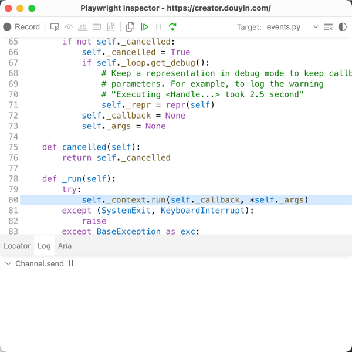
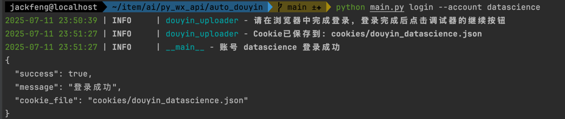
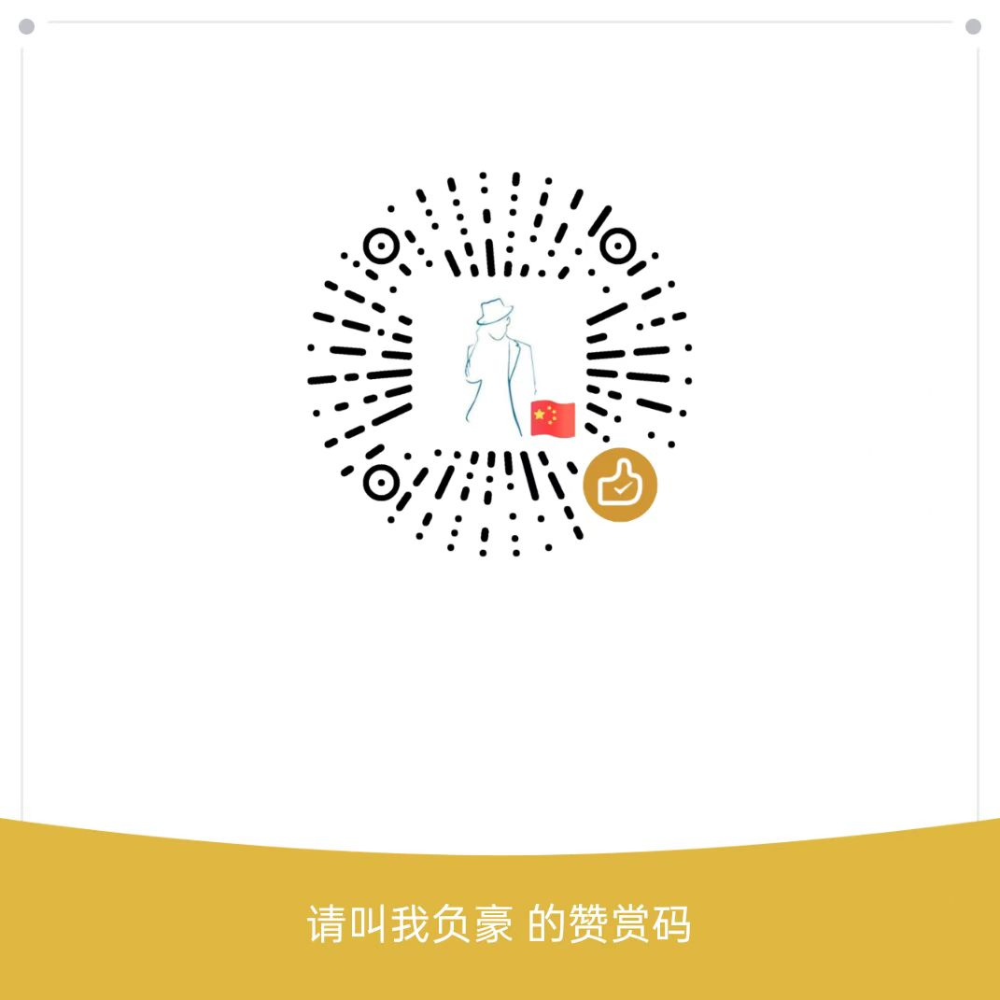

# Auto Douyin - 抖音自动上传MCP服务

独立的抖音视频自动上传工具，基于Playwright实现，支持自动登录、视频上传、定时发布等功能。

## 功能特性

- ✅ 自动登录抖音创作者中心
- ✅ 视频文件上传
- ✅ 自动填充标题和话题标签
- ✅ 定时发布功能
- ✅ 缩略图上传
- ✅ 地理位置设置
- ✅ 第三方平台同步
- ✅ Cookie管理
- ✅ 批量上传
- ✅ 完整的日志记录
- ✅ 配置文件管理

**新增的定位器类型**:
- 选择封面按钮: `text="选择封面"`, `button:has-text("选择封面")`, `[data-testid="cover-select"]`
- 设置竖封面: `text="设置竖封面"`, `text="竖封面"`, `[data-testid="vertical-cover"]`
- 文件上传: `input[type='file'][accept*='image']`, `input.semi-upload-hidden-input`
- 完成按钮: `button:has-text('完成')`, `button:has-text('确定')`, `.confirm-btn`

## 安装指南

### 1. 安装Python依赖

```bash
pip install -r requirements.txt
```

### 2. 安装Playwright浏览器驱动

```bash
playwright install chromium
```

### 3. 配置文件

复制并修改配置文件：

```bash
cp config.json config.json
```

编辑 `config.json` 文件，设置Chrome浏览器路径等配置。

## 快速开始

### 1. 登录账号

首先需要登录抖音账号并生成Cookie：

```bash
python main.py login --account your_account_name

python main.py login --account datascience
```



这会打开浏览器，请手动完成登录，登录成功后点击调试器的"继续"按钮，Cookie将自动保存。



### 2. 上传单个视频

```bash
python main.py upload --account your_account_name --video ./videos/demo.mp4 --title "我的视频标题" --tags 科技 数码 教程
python main.py upload --account datascience --video ./videos/Vertical_DataScience.mp4 --title "草莓-ASMR" --tags ASMR 解压
```

```logs
2025-07-11 23:55:18 | INFO     | douyin_uploader - cookie 有效
2025-07-11 23:55:25 | INFO     | douyin_uploader - 页面权限处理设置完成
2025-07-11 23:55:27 | INFO     | douyin_uploader - [+]正在上传-------草莓-ASMR.mp4
2025-07-11 23:55:30 | INFO     | douyin_uploader - 等待进入发布页面...
2025-07-11 23:55:33 | INFO     | douyin_uploader - 成功进入version_2发布页面!
2025-07-11 23:55:34 | INFO     | douyin_uploader - 正在填充标题和话题...
2025-07-11 23:55:35 | INFO     | douyin_uploader - 总共添加2个话题
2025-07-11 23:55:35 | INFO     | douyin_uploader - 等待视频上传完成...
2025-07-11 23:55:35 | INFO     | douyin_uploader - 正在上传视频中...
2025-07-11 23:55:37 | INFO     | douyin_uploader - 正在上传视频中...
2025-07-11 23:55:39 | INFO     | douyin_uploader - 视频上传完毕
2025-07-11 23:55:39 | INFO     | douyin_uploader - 开始设置地理位置: 北京市
2025-07-11 23:55:40 | INFO     | douyin_uploader - 成功点击地理位置输入框: div.semi-select span:has-text("输入地理位置")
2025-07-11 23:55:41 | INFO     | douyin_uploader - 已输入地理位置: 北京市
2025-07-11 23:55:44 | INFO     | douyin_uploader - 成功选择地理位置选项: div[role="listbox"] [role="option"]
2025-07-11 23:55:45 | INFO     | douyin_uploader - 地理位置设置完成: 北京市
2025-07-11 23:55:45 | INFO     | douyin_uploader - 正在发布视频...
2025-07-11 23:55:46 | INFO     | douyin_uploader - 视频发布成功
2025-07-11 23:55:46 | INFO     | douyin_uploader - Cookie已更新
2025-07-11 23:55:48 | INFO     | __main__ - 视频上传成功: 草莓-ASMR
{
  "success": true,
  "message": "视频上传成功",
  "title": "草莓-ASMR"
}
```

### 3. 定时发布

```bash
python main.py upload --account your_account_name --video ./videos/demo.mp4 --schedule "2024-01-15 18:00"
```


### 4. 批量上传

创建批量配置文件 `batch_config.json`：

```json
{
  "video_list": [
    {
      "video_path": "./videos/video1.mp4",
      "title": "视频1标题",
      "tags": ["科技", "数码"],
      "thumbnail_path": "./videos/video1.png"
    },
    {
      "video_path": "./videos/video2.mp4",
      "title": "视频2标题",
      "tags": ["教程", "学习"]
    }
  ],
  "videos_per_day": 2,
  "daily_times": [9, 15, 21],
  "start_days": 0
}
```

然后执行批量上传：

```bash
python main.py batch_upload --account your_account_name --batch-config batch_config.json
```

## 使用说明

### 视频文件格式

支持的视频格式：`.mp4`, `.avi`, `.mov`, `.mkv`, `.flv`, `.wmv`, `.m4v`

### 标题和标签文件

如果在视频文件同级目录下放置同名的 `.txt` 文件，会自动读取标题和标签：

```
demo.mp4
demo.txt
```

`demo.txt` 内容格式：
```
这是视频标题
#科技 #数码 #教程
```

### 缩略图

在视频文件同级目录下放置同名的图片文件（`.png`, `.jpg`, `.jpeg`）作为缩略图：

```
demo.mp4
demo.png
```

## 配置文件说明

`config.json` 配置项：

```json
{
  "chrome_path": "/Applications/Google Chrome.app/Contents/MacOS/Google Chrome",
  "cookies_dir": "./cookies",
  "logs_dir": "./logs",
  "videos_dir": "./videos"
}
```

- `chrome_path`: Chrome浏览器可执行文件路径
- `cookies_dir`: Cookie文件存储目录
- `logs_dir`: 日志文件存储目录
- `videos_dir`: 视频文件存储目录

## 命令行参数

### 登录命令

```bash
python main.py login --account ACCOUNT_NAME [--config CONFIG_FILE]
```

### 上传命令

```bash
python main.py upload --account ACCOUNT_NAME --video VIDEO_PATH
                      [--title TITLE] [--tags TAG1 TAG2 ...]
                      [--thumbnail THUMBNAIL_PATH] [--schedule "YYYY-MM-DD HH:MM"]
                      [--location LOCATION] [--config CONFIG_FILE]
```

### 批量上传命令

```bash
python main.py batch_upload --account ACCOUNT_NAME --batch-config BATCH_CONFIG_FILE
                            [--config CONFIG_FILE]
```

## 目录结构

```
auto_douyin/
├── main.py              # 主程序入口
├── douyin_uploader.py   # 抖音上传器
├── config.py            # 配置管理
├── logger.py            # 日志管理
├── utils.py             # 工具函数
├── stealth.min.js       # 浏览器反检测脚本
├── requirements.txt     # Python依赖
├── config.json          # 配置文件
├── cookies/             # Cookie存储目录
├── logs/                # 日志存储目录
└── videos/              # 视频文件目录
```

## 注意事项

1. **浏览器路径**: 确保配置文件中的Chrome浏览器路径正确
2. **网络环境**: 确保网络连接稳定，能正常访问抖音
3. **视频格式**: 上传的视频文件需要符合抖音的格式要求
4. **账号安全**: Cookie文件包含敏感信息，请妥善保管
5. **频率限制**: 避免过于频繁的上传操作，建议合理设置上传间隔

## 故障排除

### 1. 浏览器启动失败

检查Chrome浏览器路径是否正确：

```bash
# macOS
/Applications/Google Chrome.app/Contents/MacOS/Google Chrome

# Windows
C:/Program Files/Google/Chrome/Application/chrome.exe

# Linux
/usr/bin/google-chrome
```

### 2. Cookie失效

如果出现登录失败，请重新执行登录命令：

```bash
python main.py login --account your_account_name
```

### 3. 上传失败

查看日志文件获取详细错误信息：

```bash
tail -f logs/douyin.log
```

### 4. 视频格式不支持

确保视频文件格式为抖音支持的格式，推荐使用MP4格式。

## 开发和扩展

### 添加新功能

1. 在相应的模块中添加新方法
2. 在 `main.py` 中添加命令行参数处理
3. 更新文档和示例

### 调试模式

设置环境变量启用调试模式：

```bash
export DEBUG=1
python main.py upload --account test --video demo.mp4
```

## 许可证

MIT License

## 贡献

欢迎提交Issue和Pull Request！ 


## 赞赏




